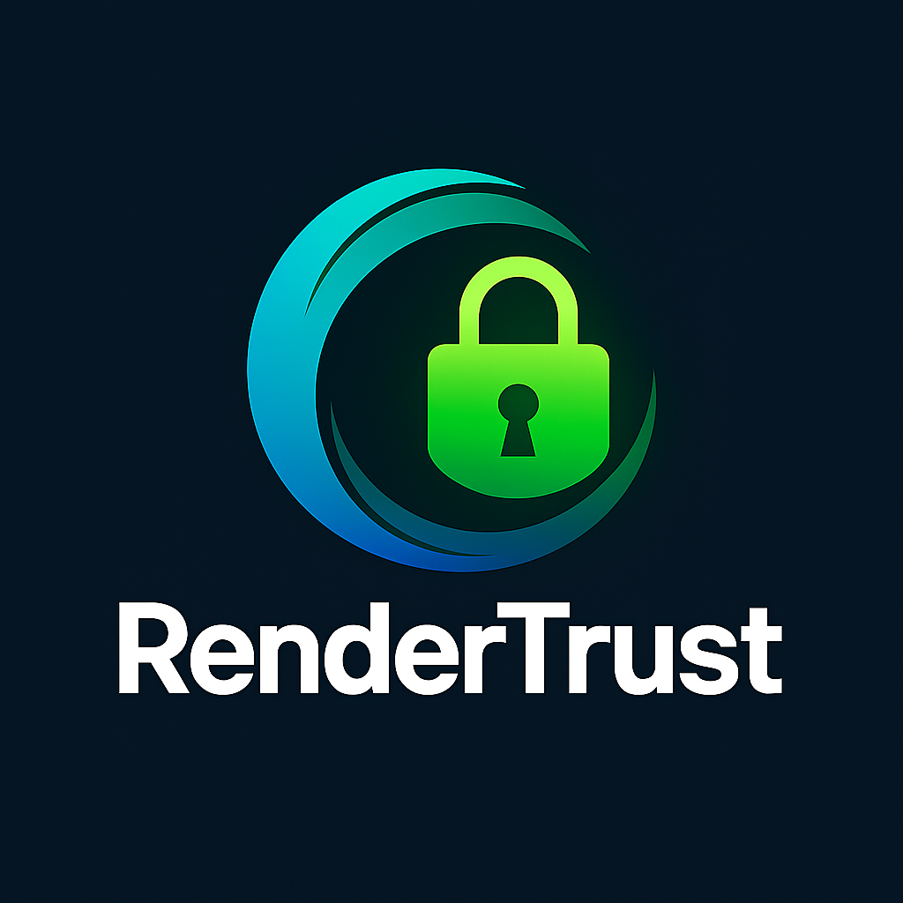

# RenderTrust



**Harness any GPU—without ever surrendering your raw files.** RenderTrust is the open‑source edge AI platform that balances **privacy**, **security**, and **elasticity** for creators of all sizes.

## Why RenderTrust Matters

In today's landscape, creative teams—from solo YouTubers to global studios—face three key barriers:

1. **Data Sovereignty**: Studios cannot risk leaking scripts, storyboards, or unreleased footage to black‑box SaaS platforms.
2. **Cost Efficiency**: Indie creators are priced out of large cloud render farms and stuck with local CPUs.
3. **Ecosystem Fragmentation**: Every model and workflow has its own API, making integration a full‑time job.

RenderTrust tears down these walls by:

- **End‑to‑end encryption**: Your prompts, frames, and metadata remain encrypted in transit and at rest.
- **Edge‑first mesh**: Community GPUs, on‑prem servers, and cloud overflow work interchangeably under a unified protocol (A2A).
- **Open standard**: JSON‑RPC A2A + optional MCP integration means any vendor or developer can plug in without re‑inventing the wheel.

Whether you're running your own nodes or tapping into public GPUs, RenderTrust ensures your IP stays under your keys—while giving you the scale and flexibility of a global compute network.

---

## Key Features

- **Distributed Compute**: Seamlessly distribute workloads across edge devices and cloud resources
- **Edge-AI Optimization**: Run AI models efficiently on edge devices with limited resources
- **Secure Billing & Ledger**: Track usage and manage billing with blockchain-based verification
- **Blueprint System**: Define complex AI workflows with reusable templates
- **Worker Management**: Deploy and monitor AI workers across your infrastructure
- **SDK Integration**: Easily integrate with your existing applications

## Repository Structure

```
rendertrust/
├─ docs/                     ← Documentation, white-paper, implementation guides
├─ diagrams/                 ← Architecture diagrams and visual assets
├─ core/                     ← Core platform components
│   ├─ scheduler/            ← Workload scheduling and distribution
│   ├─ ledger/               ← Secure transaction ledger with vault integration
│   ├─ billing/              ← Usage tracking and payment processing
│   └─ gateway/              ← API gateway and web interface
├─ edgekit/                  ← Edge deployment components
│   ├─ blueprints/           ← Reusable workflow templates
│   ├─ relay/                ← Edge-to-cloud communication
│   ├─ workers/              ← AI model execution environments
│   └─ poller/               ← Resource monitoring and scaling
├─ sdk/                      ← Client libraries and integration tools
├─ rollup_anchor/            ← Blockchain integration components
├─ loadtest/                 ← Performance testing framework
├─ ci/                       ← Continuous integration workflows
└─ tools/                    ← CLI tools and utilities
```

## Getting Started

To set up your development environment:

```bash
# Clone the repository
git clone https://github.com/cheddarfox/rendertrust.git

# Run the bootstrap script
curl -sL https://raw.githubusercontent.com/cheddarfox/rendertrust/dev/tools/bootstrap.sh | bash
```

## Architecture Diagrams

RenderTrust's architecture is illustrated through several key diagrams:


**Architecture Overview**: This diagram illustrates the high-level components of the RenderTrust platform and how they interact to provide distributed Edge-AI capabilities.


**Data Flow**: This diagram shows how data flows through the RenderTrust system, from input to processing to output.

## Documentation

Comprehensive documentation is available in the `docs/` directory, including:
- Implementation guides
- Architecture overview
- API references
- Quickstart tutorials

## Licensing

RenderTrust is a hybrid open‑source and proprietary platform with a dual-licensing model:

### Open‑Source Components (MIT/Apache-2)

These modules are fully open‑source. Contributors and operators can fork, modify, and redistribute under permissive terms:

* **A2A Protocol & SDKs** (`sdk/`): MIT License
* **Core Scheduler, Gateway, Relay** (`core/`, `edgekit/relay/`): Apache License 2.0
* **Load‑Test & CI Tools** (`loadtest/`, `ci/`): MIT License
* **Documentation & Diagrams** (`docs/`, `diagrams/`): CC0 or MIT
* **MCP Client Adapters** (`sdk/mcp/`): Apache 2.0

### Proprietary / Enterprise Components (Commercial License)

These services remain RenderTrust proprietary, licensed to enterprises under a commercial agreement:

* **Paymaster & Bundler Service** (`rollup_anchor/paymaster/`)
* **Premium Modules & Voice/LLM Models** (`edgekit/workers/premium_voice/`, `edgekit/workers/studio_llm/`)
* **Hosted Monitoring & Analytics** (Cloud services, not in repo)
* **Enterprise UIs & Branding Extensions** (`core/gateway/web/enterprise/`)

See [LICENSE-MIT](./LICENSE-MIT), [LICENSE-APACHE-2.0](./LICENSE-APACHE-2.0), and [LICENSE-ENTERPRISE](./LICENSE-ENTERPRISE) for full license texts.
